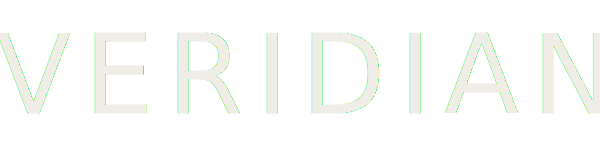

<div align="center">
  

  **Software que trabaja para vos.**

  Landing page oficial de [Veridianware](https://landing-smoky-one-33.vercel.app/) — software empresarial B2B para PYMEs.

  [🌐 Sitio en vivo](https://landing-smoky-one-33.vercel.app/) · [🛒 Gumroad](https://veridianware.gumroad.com/l/ojfbww) · [📧 Contacto](mailto:veridianware@gmail.com)
</div>

---

## Sobre el proyecto

Sitio de presentación de los productos de Veridian: un ERP modular para PYMEs y una línea de boilerplates para Node/Express extraídos de producción real.

- **Veridian ERP** — sistema de gestión empresarial (stock, finanzas, órdenes de trabajo, RRHH).
- **AuthKit Express** — boilerplate de autenticación JWT con RBAC, multi-tenant y audit logging.
- **WorkKit Express / Veridian HR** — próximamente.

## Stack

Sitio estático de una sola página, sin build step.

- HTML5 + CSS3 (variables, grid, animaciones nativas)
- JavaScript vanilla (cursor personalizado, scroll reveal, nav sticky)
- Fuentes: [Bebas Neue](https://fonts.google.com/specimen/Bebas+Neue) · [Inter](https://fonts.google.com/specimen/Inter) · [JetBrains Mono](https://fonts.google.com/specimen/JetBrains+Mono)

## Desarrollo local

```bash
git clone https://github.com/veridian-ware/index.html.git
cd index.html
# abrí index.html en el navegador o serví con cualquier HTTP server:
npx serve .
```

## Deploy

Desplegado en **Vercel** con auto-deploy desde `main`. Cada push actualiza el sitio en producción automáticamente.

## Estructura

```
.
├── index.html              # Landing completa (HTML + CSS + JS inline)
├── assets/
│   ├── logo-transparent.svg
│   └── logo-square.svg
└── README.md
```

## Identidad visual

- **Negro:** `#0a0a0a`
- **Lima (acento):** `#c8f542`
- **Teal (acento 2):** `#42f5c8`
- **Texto:** `#f0ede6`

---

<div align="center">
  © 2026 Veridian · Buenos Aires, Argentina 🇦🇷
</div>
